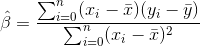
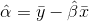

# d3construct
Visual deconstruction of data and algorithms using D3.


### [Live Site](https://www.d3construct.io)

### Background

Linear regression is a common statistical technique used to make predictions given an input variable. For example, one might predict the amount of ice cream sales based off temperature.

### Functionality

D3construct is an interactive tool allowing users to visualize data and algorithms. For a linear regression, the user is able to:

- [ ] Click on the scatter plot to add data
- [ ] View the predicted line of best fit once there are two are more points
- [ ] Drag points to new locations
- [ ] Remove points by clicking on them
- [ ] Zoom and pan on the graph

### Technologies

This project is implemented primarily with `D3` to manipulate and render data and vanilla `Javascript`.


### Code Highlights
The slope term is calculated using the following formula:



This was implemented in code as follows:

```javascript
  // Calculate means.
  const meanX = d3.mean(dataset, datum => datum.xVar);
  const meanY = d3.mean(dataset, datum => datum.yVar);

  // Calculate slope.
  const b1Numerator = dataset
    .map(datum => (datum.xVar - meanX) * (datum.yVar - meanY))
    .reduce((acc, datum) => acc + datum);
  const b1Denominator = dataset
    .map(datum => (datum.xVar - meanX) ** 2)
    .reduce((acc, datum) => acc + datum);
  const b1 = b1Numerator / b1Denominator;
```

The intercept term was calculated by solving for it given the predicted slope at the mean x and y values:



This was implemented in code as follows:

```javascript
const b0 = meanY - b1 * meanX;
```

### Future features
+ Display residuals
+ Implement other algorithms